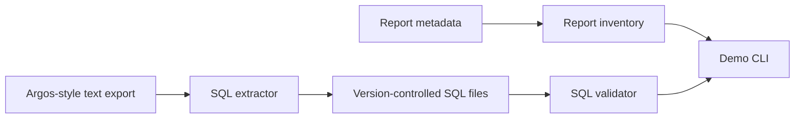

# University Report Governance System Architecture

University Report Governance System is intentionally small. The package has three main responsibilities:

- `extractor` reads text exports and saves SQL statements.
- `validator` checks report SQL for risky or weak patterns.
- `inventory` reads Argos-style metadata and summarizes report assets.

The CLI in `argos_bridge/cli.py` connects these pieces into commands that can be run locally or in a repository check.
