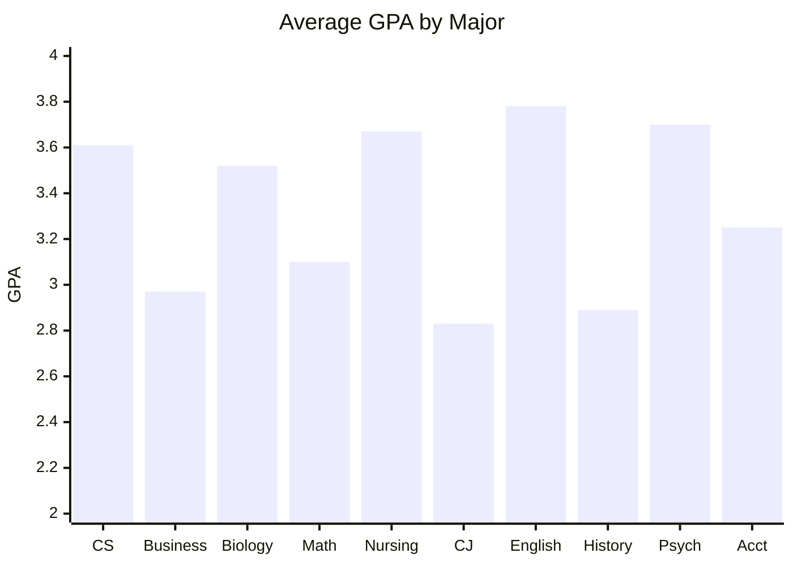
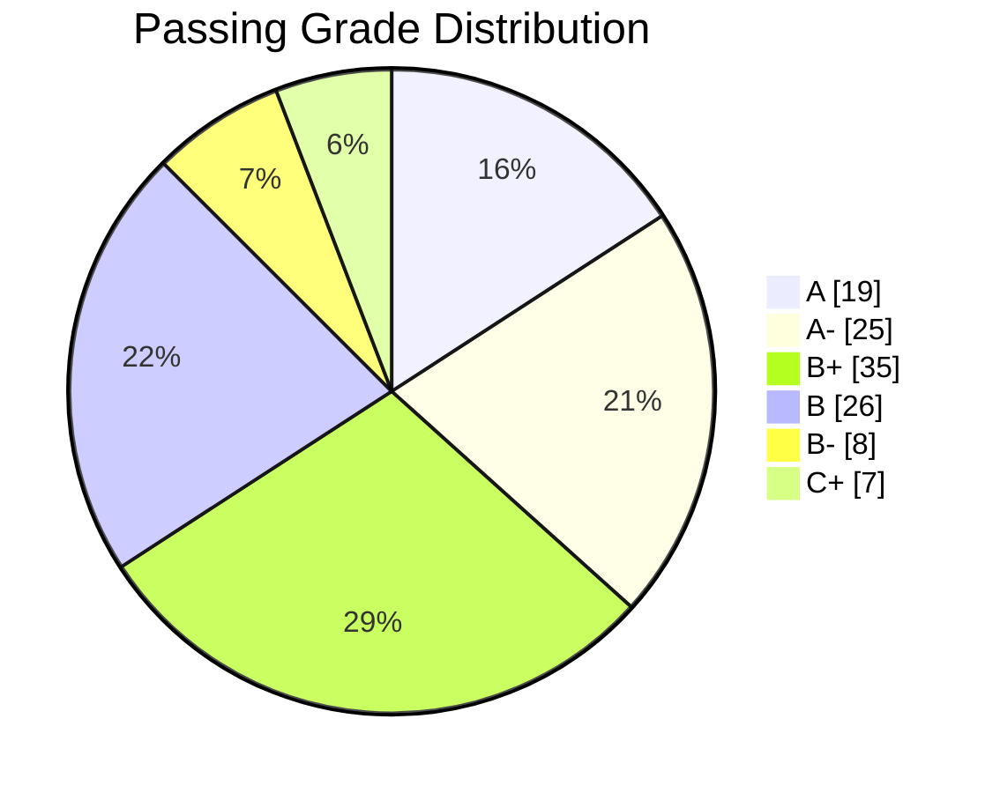

# Dean's Academic Performance Report

This report summarizes fictional Spring 2026 academic sample data for University Report Governance System. All students, professors, courses, and grades are made up for demonstration purposes.

## Executive Summary

- Students reviewed: 30
- Courses represented: 10
- Professors represented: 10
- Course enrollments reviewed: 120
- Overall GPA: 3.33
- Grade outcome: all recorded grades are passing.

## GPA By Major

## Grade Distribution

## Enrollment By Major

| Major | Students | Average GPA |
| --- | ---: | ---: |
| Accounting | 3 | 3.25 |
| Biology | 3 | 3.52 |
| Business | 3 | 2.97 |
| Computer Science | 3 | 3.61 |
| Criminal Justice | 3 | 2.83 |
| English | 3 | 3.78 |
| History | 3 | 2.89 |
| Mathematics | 3 | 3.10 |
| Nursing | 3 | 3.67 |
| Psychology | 3 | 3.70 |

## Top GPA Students

| Student ID | Student | Major | GPA |
| ---: | --- | --- | ---: |
| 1017 | Natalia Silva | English | 3.92 |
| 1001 | Ariana Lopez | Computer Science | 3.75 |
| 1007 | Camila Rivera | English | 3.75 |
| 1015 | Olivia Mendoza | Nursing | 3.75 |
| 1029 | Renata Ibarra | Psychology | 3.75 |

## Notes For Report Review

- GPA is calculated from the four recorded course grades per student.
- All grades map to passing grade points from `C+` through `A`.
- This report is safe for public demonstration because it contains no real student data.
